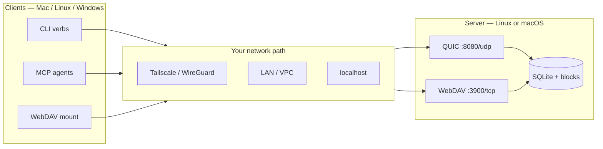

# ProxyGit Quickstart

Agnostic setup — no assumed hostnames, VPN products, or personal paths.
Replace `$SERVER_HOST` with `127.0.0.1` (local) or your private-network hostname/IP
(Tailscale, WireGuard, LAN, VPC — any reachable path).

## Platform support (honest)

| Role | macOS | Linux | Windows |
|------|-------|-------|---------|
| **Server** (`proxygit-server`) | ✅ local dev | ✅ primary (binary or Docker) | ❌ not yet (Unix APIs in server) |
| **CLI** `ls/cat/stat/write` | ✅ | ✅ | 🟡 should build; not CI-tested |
| **MCP** stdio agent tools | ✅ | ✅ | 🟡 should build; not CI-tested |
| **WebDAV** as client | ✅ Finder / `mount_webdav` | ✅ davfs2 | ✅ Map Network Drive → Linux/mac server |
| **FUSE mount** | ✅ optional (`--features fuse` + macFUSE) | ✅ optional (FUSE3) | ❌ WinFSP not implemented (installer stub only) |

**Bottom line:** run the **server on Linux or macOS**. Clients on Mac/Linux are first-class.
Windows is a **WebDAV/CLI client** story today, not a server or FUSE host.

## Prerequisites

- Rust 1.78+ (to build from source)
- Optional: Docker + Docker Compose (containerized server)
- Optional mounts as in the table above

## 1. Build

```bash
cd proxygit
cargo build --release
```

Produces:

- `./target/release/proxygit-server`
- `./target/release/proxygit-client`

Optional PATH:

```bash
export PATH="$PWD/target/release:$PATH"
```

## 2. Run the server

### Option A — local binary (recommended first run)

```bash
mkdir -p ./data
export PROXYGIT_DATA_DIR="$PWD/data"
export PROXYGIT_LISTEN=127.0.0.1:8080
export PROXYGIT_WEBDAV_LISTEN=127.0.0.1:3900
./target/release/proxygit-server
```

Expected log lines:

```
ProxyGit Server
Index directory: .../data/indexes
Block store:     .../data/blocks
Listening on:    127.0.0.1:8080
QUIC endpoint ready on 127.0.0.1:8080
WebDAV HTTP server ready on http://127.0.0.1:3900
```

Self-signed TLS material for QUIC is created at `$PROXYGIT_DATA_DIR/server_cert.der` on first boot.

Pin that cert for the client (required — a stale `~/.config/proxygit/server_cert.der` will fail with `BadSignature`):

```bash
export PROXYGIT_SERVER_CERT="$PROXYGIT_DATA_DIR/server_cert.der"
# or: cp "$PROXYGIT_DATA_DIR/server_cert.der" ~/.config/proxygit/server_cert.der
```

### Option B — Docker Compose

From the repo root:

```bash
# Trusted private network / lab (publishes on all host interfaces)
docker compose -f docker/docker-compose.yml up -d --build

# Laptop-only: publish only on loopback (standalone compose file)
docker compose -f docker/docker-compose.localhost.yml up -d --build

docker compose -f docker/docker-compose.localhost.yml logs -f proxygit-server
```

| Port | Proto | Service |
|------|-------|---------|
| 8080 | UDP | QUIC |
| 3900 | TCP | WebDAV |

Data persists in the Docker volume `proxygit-data`.

**Ports vs bind address:**

- Compose `ports:` controls **which host interfaces** publish the container ports.
- `PROXYGIT_LISTEN` / `PROXYGIT_WEBDAV_LISTEN` only change the **bind inside the container**.
- For a safe laptop demo, use `docker-compose.localhost.yml` (host `127.0.0.1:…`), not only env binds.

### Option C — remote Linux host over SSH

Any SSH-reachable Linux box works (Tailscale, WireGuard, LAN, public bastion — your choice).

```bash
rsync -av \
  --exclude target/ \
  --exclude .git/ \
  --exclude .sc/ \
  --exclude data/ \
  --exclude data-smoke/ \
  --exclude AGENTS.local.md \
  --exclude .proxygit.local.toml \
  --exclude '*.der' \
  --exclude '*.pem' \
  ./ user@your-server:~/proxygit/
ssh user@your-server 'cd ~/proxygit && docker compose -f docker/docker-compose.yml up -d --build'
```

Copy the server cert for the QUIC client:

```bash
ssh user@your-server 'docker cp proxygit-server:/data/server_cert.der /tmp/server_cert.der'
mkdir -p ~/.config/proxygit
scp user@your-server:/tmp/server_cert.der ~/.config/proxygit/server_cert.der
# or: export PROXYGIT_SERVER_CERT=~/.config/proxygit/server_cert.der
```

## 3. Choose a project id

```bash
# random
PROJECT=$(uuidgen | tr '[:upper:]' '[:lower:]')
# or fixed for demos
PROJECT=00000000-0000-0000-0000-000000000001

SERVER=127.0.0.1:8080          # or your-server:8080 on your private network
CLIENT=./target/release/proxygit-client
SERVER_HOST=127.0.0.1          # host only — backup helpers use WebDAV :3900
export PROXYGIT_SERVER_CERT="${PROXYGIT_SERVER_CERT:-$PWD/data/server_cert.der}"
```

The server creates index state for a project on first write.

## 4. Access the project (four ways)

### A. One-shot CLI (no mount, no FUSE)

```bash
$CLIENT write  "$SERVER" "$PROJECT" src/main.rs 'fn main() { println!("hi"); }'
$CLIENT ls     "$SERVER" "$PROJECT"
$CLIENT cat    "$SERVER" "$PROJECT" src/main.rs
$CLIENT stat   "$SERVER" "$PROJECT" src/main.rs
$CLIENT search "$SERVER" "$PROJECT" "main entrypoint" 5

# backups via WebDAV helper routes (server host, not :8080)
$CLIENT backup create  "$SERVER_HOST" "$PROJECT"
$CLIENT backup list    "$SERVER_HOST" "$PROJECT"
```

`write` with no text argument reads stdin:

```bash
$CLIENT write "$SERVER" "$PROJECT" notes.md < ./local-notes.md
```

### B. WebDAV mount (no kernel extension)

```bash
# macOS
mkdir -p /tmp/my-project
mount_webdav "http://${SERVER_HOST}:3900/webdav/$PROJECT" /tmp/my-project

# Linux (davfs2)
sudo mount -t davfs "http://${SERVER_HOST}:3900/webdav/$PROJECT" /mnt/my-project
```

- **macOS Finder:** Go → Connect to Server → `http://<host>:3900/webdav/<uuid>`
- **Windows:** Map Network Drive → `http://<host>:3900/webdav/<uuid>` (server still runs on Linux/mac)

### C. MCP for AI agents

```bash
./target/release/proxygit-client mcp "$SERVER" "$PROJECT"
```

JSON-RPC 2.0 MCP on stdin/stdout. Tools: `read_file`, `write_file`,
`list_directory`, `stat`, `get_project_map`, `content_search` (alias `semantic_search`).

### D. FUSE mount (optional, macOS/Linux)

```bash
cargo build --release -p proxygit-client --features fuse
./target/release/proxygit-client mount "$SERVER" "$PROJECT"
# default mount point: /tmp/proxygit/mount
./target/release/proxygit-client status
./target/release/proxygit-client unmount
```

## 5. Network topology (bring your own path)

ProxyGit does **not** require Tailscale. It needs IP reachability to:

- UDP **8080** (QUIC client ↔ server)
- TCP **3900** (WebDAV, optional)
- TCP **8082** only if you expose the client’s local MCP TCP listener (default loopback)



Pick one path, put that hostname in `$SERVER` / WebDAV URLs. Examples:

| Setup | `$SERVER` example | Notes |
|-------|-------------------|--------|
| Same machine | `127.0.0.1:8080` | safest demo |
| Tailscale | `my-box:8080` or `100.x.y.z:8080` | your tailnet names/IPs |
| WireGuard / LAN | `10.0.0.5:8080` | any private route |
| SSH tunnel only | `127.0.0.1:8080` after `ssh -L` | no UDP tunnel by default — prefer VPN for QUIC |

## 6. `.proxygit` manifest (optional, for agents)

```toml
[project]
name = "example"
uuid = "00000000-0000-0000-0000-000000000001"

[remote]
address = "127.0.0.1:8080"

[mcp]
address = "localhost:8082"
tools = ["read_file", "write_file", "list_directory", "stat", "get_project_map", "content_search"]

[webdav]
url = "http://127.0.0.1:3900/webdav/00000000-0000-0000-0000-000000000001/"

[build]
command  = "cargo build --release"
dev      = "cargo watch -x run"
artifact = "target/release/myapp"

[cache]
strategy = "ram_disk"    # ram_disk | local_dir | none
size     = "4GB"
paths    = ["target", "node_modules"]
```

## 7. Environment reference

| Variable | Default | Notes |
|----------|---------|--------|
| `PROXYGIT_DATA_DIR` | binary: `/tmp/proxygit-server/data`; Docker: `/data` | indexes, blocks, certs, backups |
| `PROXYGIT_LISTEN` | `0.0.0.0:8080` | QUIC bind **inside** process/container |
| `PROXYGIT_WEBDAV_LISTEN` | `0.0.0.0:3900` | WebDAV bind; **no auth** |
| `PROXYGIT_SERVER_CERT` | search path | Client pin to server’s `server_cert.der` |
| `PROXYGIT_TOKEN` | unset | Optional shared secret (server + client). Auth **off** when unset. `proxygit-client gen-token` |
| `PROXYGIT_TOKEN_FILE` | unset | Token file alternative to `PROXYGIT_TOKEN` |
| `PROXYGIT_MTLS_CA` | unset | Server: path to CA cert DER; clients must present a leaf signed by it |
| `PROXYGIT_CLIENT_CERT` | unset | Client: mTLS leaf cert DER (`proxygit-client gen-mtls`) |
| `PROXYGIT_CLIENT_KEY` | unset | Client: mTLS leaf key DER (PKCS#8) |
| `PROXYGIT_WRITE_CONFLICT` | `last_writer_wins` | `reject_stale` enables expected-hash checks; client auto-stats base when unset |
| `PROXYGIT_EXPECTED_TREE_HASH` | unset | Client CLI: 64-hex base hash override for conditional write |
| `PROXYGIT_EMBEDDING` | `features` | Server: `features` (token bag) or `hash` (BLAKE3 mock) |

## 8. Feature checklist

| Feature | Status |
|---------|--------|
| QUIC transport + SQLite index + block store | ✅ |
| CLI verbs (`ls` / `cat` / `stat` / `write` / `search`) | ✅ |
| MCP (stdio + optional TCP) | ✅ |
| WebDAV native mount | ✅ |
| FUSE mount | Optional, macOS/Linux |
| Server-side backup create/list/restore | ✅ |
| Windows server / WinFSP | Future |
| Object-store backend (Garage/S3) | Future |
| Optional bearer token + mTLS | ✅ off by default (`PROXYGIT_TOKEN`, `PROXYGIT_MTLS_CA`) |

## 9. Troubleshooting

| Symptom | Check |
|---------|--------|
| Client can't connect | UDP 8080 open on your path? Correct `host:port`? |
| `invalid peer certificate: BadSignature` | Stale cert. `export PROXYGIT_SERVER_CERT=$PROXYGIT_DATA_DIR/server_cert.der` for **this** server |
| WebDAV mount fails | TCP 3900 reachable? URL includes `/webdav/<uuid>`? |
| Empty `ls` | No files yet for that UUID — `write` first |
| Tests fail on macOS paths | `TMPDIR=/tmp cargo test …` |

## 10. Next reading

- [`README.md`](README.md) — problem statement & security  
- [`docs/site/`](docs/site/) — share landing + diagrams  
- [`SPEC.md`](SPEC.md) — protocols  
- [`ARCHITECTURE-ROADMAP.md`](ARCHITECTURE-ROADMAP.md) — gaps  
